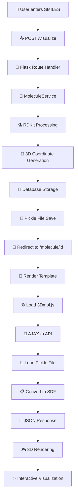

# 🧬 Molecule Visualization Platform

> A comprehensive web application for visualizing molecular structures from SMILES notation using RDKit and 3Dmol.js

---

## 📚 Table of Contents

- [Overview](#overview)
- [Architecture](#architecture)
- [Data Flow](#data-flow)
- [File Structure](#file-structure)
- [Workflow Breakdown](#workflow-breakdown)
- [API Reference](#api-reference)
- [Technology Stack](#technology-stack)

---

## 🎯 Overview

This project transforms SMILES (Simplified Molecular Input Line Entry System) strings into interactive 3D molecular visualizations. The platform leverages RDKit for chemical processing and 3Dmol.js for stunning 3D rendering.

### Key Features

- 🔬 **SMILES to 3D Conversion** - Automatic coordinate generation
- 🎨 **Interactive Visualization** - Rotate, zoom, and explore molecules
- 💾 **Persistent Storage** - SQLite database with pickle file caching
- 🎭 **Multiple Viewing Modes** - Stick, sphere, and cartoon representations
- 📱 **Responsive Design** - Bootstrap-powered UI

---

## 🏗️ Architecture

### Component Overview

```
┌─────────────────┐
│   Frontend UI   │  ← Templates (Jinja2) + Bootstrap
├─────────────────┤
│   JavaScript    │  ← 3Dmol.js + AJAX handling
├─────────────────┤
│  Flask Routes   │  ← HTTP endpoints + routing
├─────────────────┤
│ Service Layer   │  ← Business logic (MoleculeService)
├─────────────────┤
│  RDKit Engine   │  ← Chemical processing + 3D generation
├─────────────────┤
│   Data Layer    │  ← SQLite + Pickle files
└─────────────────┘
```

### JavaScript Architecture

| File | Purpose | Status |
|------|---------|--------|
| **main.js** | Global utilities (tooltips, notifications) | ✅ Active |
| **viewer.js** | MoleculeViewer class definition | ⚠️ Not currently used |
| **visualize.html** | Inline 3D visualization logic | ✅ Primary implementation |

> **Note**: The current implementation uses inline JavaScript in `visualize.html` rather than the `viewer.js` class.

---

## 🚀 Data Flow

### Complete Request Lifecycle



### Data Transformation Pipeline

```
SMILES String → RDKit Mol Object → 3D Coordinates → Pickle File → SDF Format → 3Dmol.js
```

---

## 📂 File Structure

```
project/
├── app.py                          # Flask application & routes
├── models/
│   └── molecule.py                 # SQLAlchemy models
├── services/
│   └── molecule_service.py         # Business logic layer
├── templates/
│   ├── base.html                   # Base template (all scripts)
│   ├── index.html                  # Input form
│   ├── gallery.html                # Molecule list
│   └── visualize.html              # 3D viewer page
├── static/
│   ├── js/
│   │   ├── main.js                 # Global utilities
│   │   └── viewer.js               # Viewer class (unused)
│   └── css/
│       └── styles.css
└── data/
    └── molecules/                  # Pickle file storage
        └── {id}.pkl
```

---

## 🔬 Workflow Breakdown

### Step 1: User Input

**File**: `templates/index.html`

```html
<form action="{{ url_for('visualize') }}" method="post">
    <input name="smiles" type="text" placeholder="e.g., CCO" required>
    <input name="name" type="text" placeholder="Ethanol">
    <button type="submit">🔬 Visualize Molecule</button>
</form>
```

### Step 2: Flask Route Handler

**File**: `app.py`

```python
@app.route('/visualize', methods=['POST'])
def visualize():
    smiles = request.form.get('smiles')
    name = request.form.get('name', 'Unnamed Molecule')
    
    # Process with service layer
    molecule, error = molecule_service.create_molecule_from_smiles(smiles, name)
    
    if error:
        flash(error, 'danger')
        return redirect(url_for('index'))
    
    return redirect(url_for('visualize_molecule', molecule_id=molecule.id))
```

### Step 3: RDKit Processing

**File**: `services/molecule_service.py`

```python
def create_molecule_from_smiles(self, smiles, name):
    # Convert SMILES to molecule
    mol = Chem.MolFromSmiles(smiles)
    
    # Add hydrogens for realistic structure
    mol = Chem.AddHs(mol)
    
    # Generate 3D coordinates
    AllChem.EmbedMolecule(mol, AllChem.ETKDG())
    
    # Optimize geometry with force field
    AllChem.MMFFOptimizeMolecule(mol)
    
    # Calculate molecular properties
    formula = Chem.rdMolDescriptors.CalcMolFormula(mol)
    weight = Descriptors.MolWt(mol)
    
    # Persist to database
    molecule = Molecule(name=name, smiles=smiles, formula=formula)
    db.session.add(molecule)
    db.session.commit()
    
    # Save as pickle file
    file_path = f"data/molecules/{molecule.id}.pkl"
    with open(file_path, 'wb') as f:
        pickle.dump(mol, f)
    
    return molecule, None
```

### Step 4: Template Rendering

**File**: `templates/visualize.html`

```html
<div id="viewer" style="height: 600px; width: 100%;"></div>

<script>
let viewer;

function initializeViewer() {
    // Create 3Dmol viewer instance
    viewer = $3Dmol.createViewer("viewer", {
        backgroundColor: 'black',
        antialias: true
    });
    
    // Fetch molecule data
    fetch(`/api/molecule/{{ molecule.id }}/data`)
        .then(response => response.json())
        .then(data => {
            // Render molecule
            viewer.addModel(data.sdf, "sdf");
            viewer.setStyle({}, {
                stick: { radius: 0.15, colorscheme: 'Jmol' },
                sphere: { radius: 0.3, colorscheme: 'Jmol' }
            });
            viewer.zoomTo();
            viewer.render();
        });
}

// Initialize on page load
document.addEventListener('DOMContentLoaded', initializeViewer);
</script>
```

### Step 5: API Data Retrieval

**File**: `app.py`

```python
@app.route('/api/molecule/<int:molecule_id>/data')
def get_molecule_data(molecule_id):
    # Retrieve from database
    molecule = molecule_service.get_molecule_by_id(molecule_id)
    
    # Load pickle file
    mol = molecule_service.load_molecule_file(molecule.file_path)
    
    # Convert to SDF format for 3Dmol.js
    sdf_data = Chem.MolToMolBlock(mol)
    
    return jsonify({
        'sdf': sdf_data,
        'name': molecule.name,
        'formula': molecule.formula,
        'weight': molecule.molecular_weight
    })
```

### Step 6: 3D Visualization

**Library**: `3Dmol.js`

```javascript
// Add molecule to scene
viewer.addModel(data.sdf, "sdf");

// Apply visual styling
viewer.setStyle({}, {
    stick: { radius: 0.15, colorscheme: 'Jmol' },
    sphere: { radius: 0.3, colorscheme: 'Jmol' }
});

// Camera controls
viewer.zoomTo();      // Fit to viewport
viewer.render();      // Render scene
viewer.spin(true);    // Auto-rotate
```

---

## 🔌 API Reference

### Endpoints

| Method | Endpoint | Description |
|--------|----------|-------------|
| `GET` | `/` | Landing page with input form |
| `POST` | `/visualize` | Process SMILES and create molecule |
| `GET` | `/molecule/<id>` | View molecule visualization |
| `GET` | `/api/molecule/<id>/data` | Retrieve molecule SDF data |
| `GET` | `/gallery` | List all molecules |
| `DELETE` | `/api/molecule/<id>` | Delete molecule |

### API Response Format

```json
{
  "sdf": "...",
  "name": "Ethanol",
  "formula": "C2H6O",
  "weight": 46.069,
  "smiles": "CCO"
}
```

---

## 🛠️ Technology Stack

### Backend

- **Flask** - Web framework
- **SQLAlchemy** - ORM for database management
- **RDKit** - Chemical informatics and 3D coordinate generation
- **SQLite** - Lightweight database storage

### Frontend

- **3Dmol.js** - WebGL-based molecular visualization
- **Bootstrap 5** - Responsive UI framework
- **Jinja2** - Server-side templating
- **Vanilla JavaScript** - DOM manipulation and AJAX

### Data Storage

- **SQLite Database** - Metadata and relationships
- **Pickle Files** - Serialized RDKit molecule objects

---

## 🎨 Code Locations Reference

```python
# 1️⃣ SMILES Input
# 📍 templates/index.html:23-26
<input type="text" name="smiles">

# 2️⃣ RDKit Processing
# 📍 services/molecule_service.py:15-25
mol = Chem.MolFromSmiles(smiles)
AllChem.EmbedMolecule(mol)

# 3️⃣ 3D Coordinate Generation
# 📍 services/molecule_service.py:20-21
AllChem.EmbedMolecule(mol, AllChem.ETKDG())
AllChem.MMFFOptimizeMolecule(mol)

# 4️⃣ Database Storage
# 📍 services/molecule_service.py:27-36
db.session.add(molecule)
pickle.dump(mol, f)

# 5️⃣ 3Dmol.js Visualization
# 📍 templates/visualize.html:329-340
viewer.addModel(data.sdf, "sdf")
viewer.render()
```

---

## 🔍 Key Design Decisions

### Why Pickle Files?

RDKit molecule objects contain complex 3D coordinate data and conformers that are efficiently serialized with pickle, enabling fast retrieval without recomputing geometry.

### Why SDF Format for Frontend?

3Dmol.js natively supports SDF (Structure Data Format), which is the standard chemical exchange format. Converting from pickle to SDF happens on-demand via the API.

### Why Inline JavaScript?

The current implementation uses inline JavaScript in `visualize.html` for simplicity and direct access to template variables. The `viewer.js` class exists but is not actively used.

---

## 📊 Performance Characteristics

| Operation | Complexity | Notes |
|-----------|-----------|-------|
| SMILES → 3D | O(n²) | RDKit force field optimization |
| Database query | O(1) | Indexed by molecule ID |
| Pickle load | O(n) | Linear with molecule size |
| SDF conversion | O(n) | Fast serialization |
| 3D rendering | O(n) | WebGL acceleration |

---

## 🚦 Request Flow Summary

```
User Input → Flask → Service → RDKit → Database → Template → AJAX → API → 3Dmol.js
   HTML      POST    Python    3D Gen   SQLite    Jinja2    Async   JSON   WebGL
```

**This is a Python-centric architecture** where heavy chemical processing happens server-side with RDKit, while the frontend focuses on visualization and interaction.

---

## 📝 Notes

- Template inheritance: `base.html` → `index.html` / `gallery.html` / `visualize.html`
- `main.js` provides global utilities across all pages
- `viewer.js` contains an unused `MoleculeViewer` class for potential refactoring
- Current implementation prioritizes simplicity over modularity

---

Made with 🧪 by chemistry enthusiasts